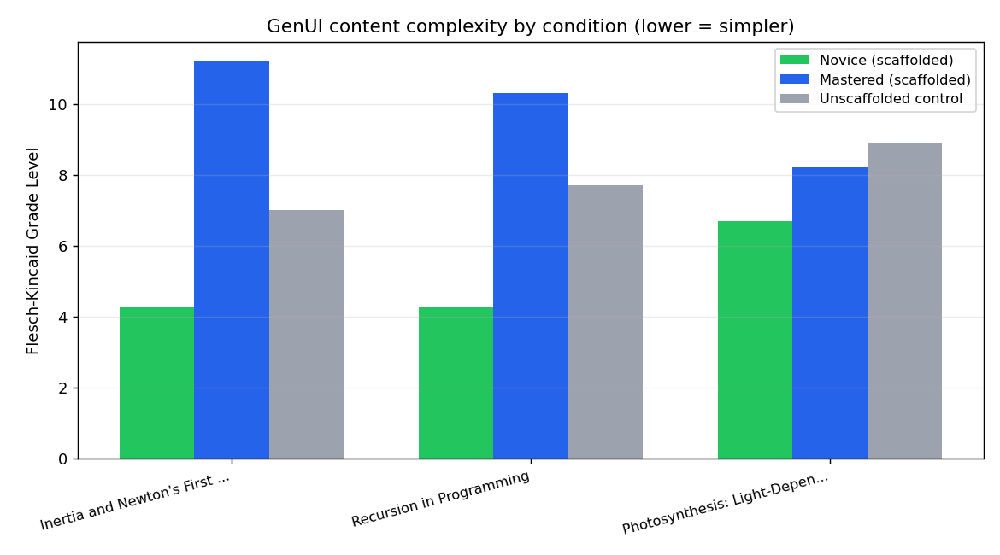

# GenUI Scaffolding Ablation Report

Model: `openai/gpt-oss-120b`. Readability via Flesch-Kincaid Grade Level (higher = harder to read / more advanced).

| Concept | Novice (scaffolded) | Mastered (scaffolded) | Unscaffolded control |
|---|---|---|---|
| Inertia and Newton's First Law | 4.3 | 11.2 | 7.0 |
| Recursion in Programming | 4.3 | 10.3 | 7.7 |
| Photosynthesis: Light-Dependent Reactions | 6.7 | 8.2 | 8.9 |

**Average grade level** — novice: 5.1, mastered: 9.9, unscaffolded control: 7.87

Novice -> mastered grade-level gap: **4.8**. A positive gap is the core claim under test: that BKT-driven scaffolding produces measurably simpler content for a novice than for a student who has mastered the concept, using the identical underlying model and topic. The unscaffolded control shows what a non-adaptive system (no BKT gating) would produce for the same topic — one grade level for every student regardless of where they actually are.
